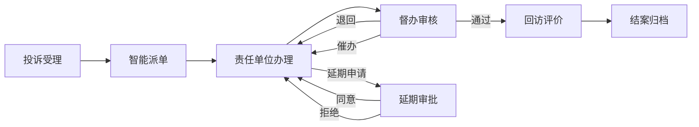

## 1. 产品概述

城市治理投诉建议闭环平台是一套集投诉受理、自动派单、办理督办、数据统计于一体的全流程闭环管理系统。平台整合网页提交、热线导入、后台录入三种投诉来源，通过智能派单机制将投诉分发给责任单位，并提供督办管理和统计分析功能，实现城市治理问题的高效处置和可追溯管理。

- 核心目标：构建"受理-派单-办理-督办-回访-归档"的全闭环治理体系
- 目标用户：市民群众、热线坐席、后台管理员、责任单位、督办人员
- 产品价值：提升城市治理效率，缩短问题处置周期，提高市民满意度

## 2. 核心功能

### 2.1 用户角色

| 角色 | 登录方式 | 核心权限 |
|------|----------|----------|
| 市民用户 | 匿名/手机号 | 网页提交投诉建议、查询办理进度、评价满意度 |
| 热线坐席 | 账号登录 | 热线导入投诉、录入投诉信息、查询投诉状态 |
| 系统管理员 | 账号登录 | 后台录入投诉、系统配置、用户管理、分类管理 |
| 责任单位 | 账号登录 | 接收派单、办理投诉、提交办理结果、申请延期 |
| 督办人员 | 账号登录 | 退回重办、发起催办、延期审批、抽查回访、统计分析 |

### 2.2 功能模块

1. **数据驾驶舱**：整体数据概览、关键指标展示、热点区域分布
2. **投诉管理**：投诉列表、投诉详情、新增投诉、投诉搜索筛选
3. **智能派单**：自动分配规则、手动转办、派单记录
4. **办理管理**：待办列表、办理提交、延期申请
5. **督办管理**：退回管理、催办管理、延期审批、抽查回访
6. **统计分析**：办理时长统计、超期率分析、满意度分析、重复投诉分析
7. **时间线追溯**：全流程操作记录、时间节点展示

### 2.3 页面详情

| 页面名称 | 模块名称 | 功能描述 |
|-----------|-------------|---------------------|
| 登录页 | 登录表单 | 账号密码登录、角色选择、验证码 |
| 数据驾驶舱 | 指标卡片 | 投诉总量、办理中、已办结、超期数量、满意度、平均办理时长 |
| 数据驾驶舱 | 趋势图表 | 近30天投诉趋势、办理趋势折线图 |
| 数据驾驶舱 | 分类统计 | 事项分类饼图、来源分布柱状图 |
| 数据驾驶舱 | 热点区域 | 区域投诉热力图/排行榜 |
| 数据驾驶舱 | 重复投诉 | 重复投诉TOP榜单 |
| 投诉列表页 | 筛选栏 | 来源、状态、分类、区域、时间范围筛选 |
| 投诉列表页 | 数据表格 | 投诉编号、标题、来源、分类、区域、责任单位、状态、时限、操作 |
| 投诉列表页 | 新增按钮 | 后台录入投诉表单 |
| 投诉详情页 | 基本信息 | 投诉标题、内容、附件、联系人信息 |
| 投诉详情页 | 流程时间线 | 派单、转办、退回、延期、回复、回访全流程时间轴 |
| 投诉详情页 | 办理信息 | 责任单位、办理结果、办理附件 |
| 投诉详情页 | 操作栏 | 转办、退回、催办、延期、回访等操作按钮 |
| 待办事项页 | 待办列表 | 责任单位待办理的投诉清单 |
| 待办事项页 | 办理表单 | 办理结果填写、附件上传、提交办理 |
| 督办管理页 | 督办列表 | 需督办的投诉清单 |
| 督办管理页 | 督办操作 | 退回重办、发起催办、延期审批、抽查回访 |
| 统计分析页 | 时长分析 | 平均办理时长、分类别时长对比 |
| 统计分析页 | 超期分析 | 超期率统计、超期投诉清单 |
| 统计分析页 | 满意度分析 | 满意度评分、评价分布 |
| 统计分析页 | 重复投诉分析 | 重复投诉识别、重复率统计 |

## 3. 核心流程

### 3.1 投诉受理流程

市民通过网页提交投诉建议，或热线坐席接听电话后录入系统，或后台管理员直接录入。系统记录投诉的基本信息、分类、区域等。

### 3.2 智能派单流程

系统根据投诉的区域、事项分类、关键词等信息，按照预设的派单规则，自动将投诉派发给对应的责任单位。如无法自动派单，则进入人工派单队列。

### 3.3 办理反馈流程

责任单位收到派单通知后，在规定时限内进行处理。处理完成后提交办理结果和相关证明材料。如需延长办理时间，可提交延期申请。

### 3.4 督办管理流程

督办人员可对办理中的投诉进行监督管理：对办理结果不满意的可退回重办，对即将超期的可发起催办，对延期申请进行审批，对已办结的进行抽查回访。

### 3.5 流程时序图

## 4. 用户界面设计

### 4.1 设计风格

- **主色调**：政务蓝（#1890ff）作为主色调，体现专业、可信的政务形象
- **辅助色**：成功绿（#52c41a）、警告橙（#faad14）、危险红（#f5222d）用于状态标识
- **中性色**：深灰（#333333）正文、中灰（#666666）辅助文字、浅灰（#f0f2f5）背景
- **按钮风格**：圆角矩形按钮，主按钮填充主色，次按钮描边样式
- **字体**：中文使用思源黑体，数字使用等宽字体，标题加粗突出
- **布局风格**：顶部导航 + 左侧菜单 + 主内容区的经典后台布局，卡片式内容展示
- **图标风格**：线性图标，统一线宽和圆角风格

### 4.2 页面设计概览

| 页面名称 | 模块名称 | UI 元素 |
|-----------|-------------|----------|
| 数据驾驶舱 | 指标卡片 | 渐变色卡片、大字号数字、趋势箭头、图标装饰 |
| 数据驾驶舱 | 图表区域 | ECharts图表、卡片容器、切换标签 |
| 数据驾驶舱 | 列表区域 | 数据表格、排名序号、状态标签 |
| 投诉列表页 | 筛选栏 | 下拉选择器、日期选择器、搜索框、重置按钮 |
| 投诉列表页 | 数据表格 | 斑马纹、悬停高亮、状态标签、操作列 |
| 投诉详情页 | 时间线 | 纵向时间轴、节点圆点、连接线、状态色标 |
| 投诉详情页 | 信息卡片 | 分栏布局、标签页切换、详情字段 |
| 登录页 | 登录表单 | 居中卡片、渐变背景、表单输入、登录按钮 |

### 4.3 响应式

- 采用桌面端优先设计，主内容区最小宽度1200px
- 支持平板端自适应，左侧菜单可折叠收起
- 关键数据卡片支持堆叠展示，确保信息可读性
- 表格区域支持横向滚动，保证小屏设备可用性

### 4.4 动效设计

- 页面加载采用渐入动画，元素依次淡入
- 数据指标变化采用数字滚动动画
- 时间线节点展开/收起飞入效果
- 状态切换平滑过渡动画
- 悬停效果：按钮、卡片、表格行均有微妙的悬停反馈
