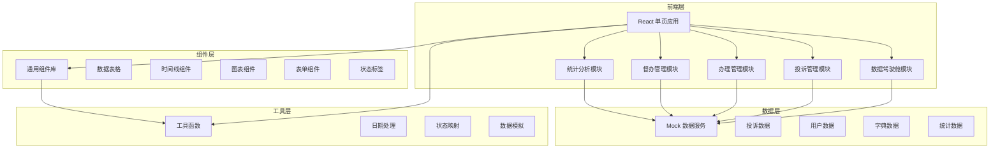
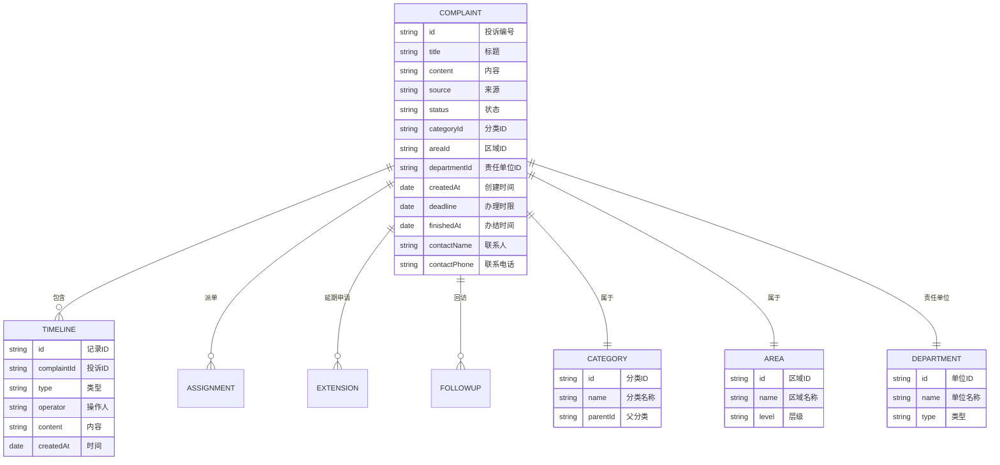

## 1. 架构设计

## 2. 技术说明

- **前端框架**：React 18 + TypeScript + Vite
- **UI 框架**：Ant Design 5.x
- **图表库**：ECharts 5.x
- **样式方案**：TailwindCSS 3.x + CSS Modules
- **路由管理**：React Router v6
- **状态管理**：React Hooks (useState/useContext)
- **数据模拟**：Mock.js + 本地 JSON 数据
- **构建工具**：Vite 5.x
- **代码规范**：ESLint + Prettier

## 3. 路由定义

| 路由路径 | 页面名称 | 说明 |
|----------|----------|------|
| /login | 登录页 | 用户登录入口 |
| /dashboard | 数据驾驶舱 | 数据概览、统计图表 |
| /complaints | 投诉列表 | 投诉清单、筛选搜索 |
| /complaints/:id | 投诉详情 | 投诉信息、时间线、操作 |
| /complaints/new | 新增投诉 | 后台录入投诉表单 |
| /my-tasks | 待办事项 | 责任单位待办清单 |
| /supervision | 督办管理 | 督办操作、延期审批 |
| /statistics | 统计分析 | 多维度统计分析 |

## 4. 数据模型

### 4.1 数据实体关系

### 4.2 状态枚举

- **投诉状态**：待受理、待派单、办理中、待审核、已退回、已办结、已超期
- **来源**：网页提交、热线导入、后台录入
- **时间线类型**：受理、派单、转办、办理、退回、延期、催办、回访、办结

### 4.3 模拟数据说明

- 模拟50条以上投诉数据，覆盖各种状态、来源、分类
- 生成近30天的趋势数据
- 构建区域、分类、部门等基础字典数据
- 生成时间线记录，每条投诉包含3-8条操作记录

## 5. 核心功能模块设计

### 5.1 智能派单逻辑
- 基于区域 + 分类的双重匹配规则
- 关键词模糊匹配辅助分派
- 支持手动调整和转办
- 派单记录全程留痕

### 5.2 时间线组件
- 纵向时间轴布局
- 不同类型节点不同颜色和图标
- 显示操作人、时间、详细内容
- 支持展开/收起详情

### 5.3 统计分析模块
- 办理时长：平均时长、分类别时长、趋势变化
- 超期率：总体超期率、各单位超期率
- 满意度：满意度分布、平均分、趋势
- 重复投诉：识别规则、重复率、TOP榜单
- 热点区域：区域投诉量排名、热力分布

### 5.4 督办功能
- 退回重办：填写退回原因，重新进入办理流程
- 发起催办：发送催办通知，记录催办次数
- 延期审批：审批延期申请，可同意或拒绝
- 抽查回访：随机抽查已办结案件，进行回访评价
